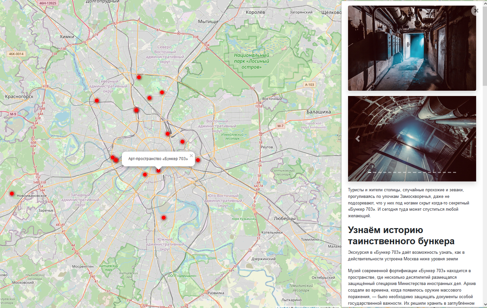

# Яндекс.Афиша

Интерактивный сайт с картой интересных мест


## Пример места

[](https://github.com/M1nZof/billboard/blob/main/screenshots/%D0%9F%D1%80%D0%B8%D0%BC%D0%B5%D1%80%20%D0%BC%D0%B5%D1%81%D1%82%D0%B0.png)

## Установка зависимостей

```commandline
pip install -r requirements.txt
```

## Запуск миграций

```commandline
python manage.py migrate
```

## Запуск локального сервера

```commandline
python manage.py runserver
```

## [Демонстрация задеплоенного сайта](http://m1nz.pythonanywhere.com/)
